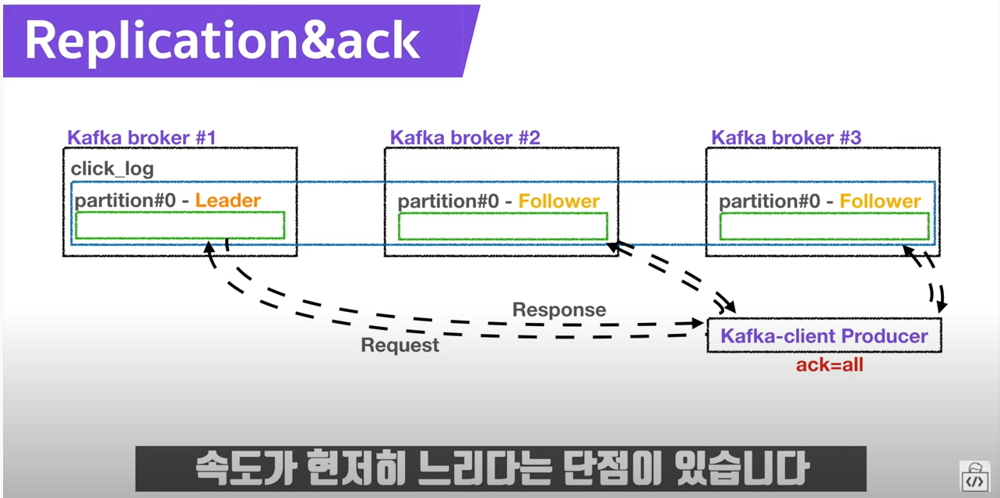

# kafka

## 카프카 Replication & ack
- broker
- replication
  - Leader partition : 원본 / 데이터를 받는다.
  - Follower Partition : 복제품
- Ack
  - 0 : leader parition에 전송
  - 1 : leader parition에 전송하고 응답값을 받음. 복제 여부는 알 수 없음.
  - all : 1 / Follower partition에 전달 된 것을 확인 함. 속도가 현저히 느림

## Reference
- [📝강의 - 아파치 카프카](https://www.youtube.com/playlist?list=PL3Re5Ri5rZmkY46j6WcJXQYRlDRZSUQ1j)